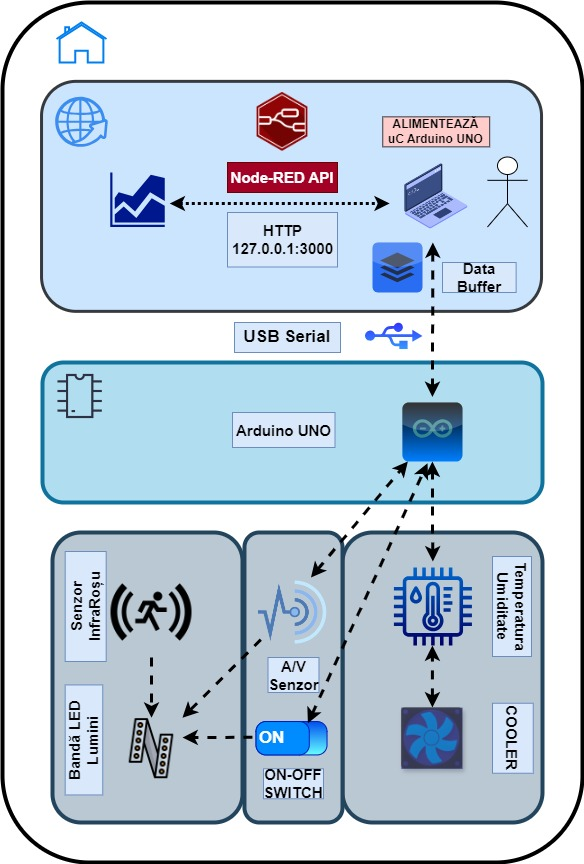
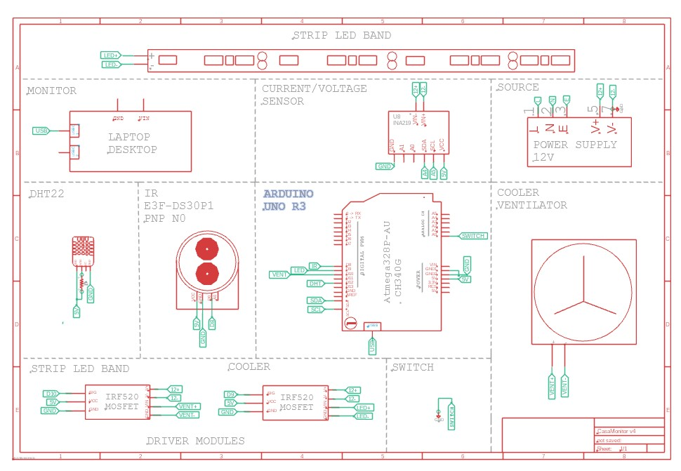

# 🏡 [CasaMonitor](https://ocw.cs.pub.ro/courses/pm/prj2024/fstancu/justin.popescu1605?&#hardware_design)

 ![Build with PlatformIO](https://img.shields.io/badge/build%20with-PlatformIO-orange?logo=data%3Aimage%2Fsvg%2Bxml%3Bbase64%2CPHN2ZyB3aWR0aD0iMjUwMCIgaGVpZ2h0PSIyNTAwIiB2aWV3Qm94PSIwIDAgMjU2IDI1NiIgeG1sbnM9Imh0dHA6Ly93d3cudzMub3JnLzIwMDAvc3ZnIiBwcmVzZXJ2ZUFzcGVjdFJhdGlvPSJ4TWlkWU1pZCI+PHBhdGggZD0iTTEyOCAwQzkzLjgxIDAgNjEuNjY2IDEzLjMxNCAzNy40OSAzNy40OSAxMy4zMTQgNjEuNjY2IDAgOTMuODEgMCAxMjhjMCAzNC4xOSAxMy4zMTQgNjYuMzM0IDM3LjQ5IDkwLjUxQzYxLjY2NiAyNDIuNjg2IDkzLjgxIDI1NiAxMjggMjU2YzM0LjE5IDAgNjYuMzM0LTEzLjMxNCA5MC41MS0zNy40OUMyNDIuNjg2IDE5NC4zMzQgMjU2IDE2Mi4xOSAyNTYgMTI4YzAtMzQuMTktMTMuMzE0LTY2LjMzNC0zNy40OS05MC41MUMxOTQuMzM0IDEzLjMxNCAxNjIuMTkgMCAxMjggMCIgZmlsbD0iI0ZGN0YwMCIvPjxwYXRoIGQ9Ik0yNDkuMzg2IDEyOGMwIDY3LjA0LTU0LjM0NyAxMjEuMzg2LTEyMS4zODYgMTIxLjM4NkM2MC45NiAyNDkuMzg2IDYuNjEzIDE5NS4wNCA2LjYxMyAxMjggNi42MTMgNjAuOTYgNjAuOTYgNi42MTQgMTI4IDYuNjE0YzY3LjA0IDAgMTIxLjM4NiA1NC4zNDYgMTIxLjM4NiAxMjEuMzg2IiBmaWxsPSIjRkZGIi8+PHBhdGggZD0iTTE2MC44NjkgNzQuMDYybDUuMTQ1LTE4LjUzN2M1LjI2NC0uNDcgOS4zOTItNC44ODYgOS4zOTItMTAuMjczIDAtNS43LTQuNjItMTAuMzItMTAuMzItMTAuMzJzLTEwLjMyIDQuNjItMTAuMzIgMTAuMzJjMCAzLjc1NSAyLjAxMyA3LjAzIDUuMDEgOC44MzdsLTUuMDUgMTguMTk1Yy0xNC40MzctMy42Ny0yNi42MjUtMy4zOS0yNi42MjUtMy4zOWwtMi4yNTggMS4wMXYxNDAuODcybDIuMjU4Ljc1M2MxMy42MTQgMCA3My4xNzctNDEuMTMzIDczLjMyMy04NS4yNyAwLTMxLjYyNC0yMS4wMjMtNDUuODI1LTQwLjU1NS01Mi4xOTd6TTE0Ni41MyAxNjQuOGMtMTEuNjE3LTE4LjU1Ny02LjcwNi02MS43NTEgMjMuNjQzLTY3LjkyNSA4LjMyLTEuMzMzIDE4LjUwOSA0LjEzNCAyMS41MSAxNi4yNzkgNy41ODIgMjUuNzY2LTM3LjAxNSA2MS44NDUtNDUuMTUzIDUxLjY0NnptMTguMjE2LTM5Ljc1MmE5LjM5OSA5LjM5OSAwIDAgMC05LjM5OSA5LjM5OSA5LjM5OSA5LjM5OSAwIDAgMCA5LjQgOS4zOTkgOS4zOTkgOS4zOTkgMCAwIDAgOS4zOTgtOS40IDkuMzk5IDkuMzk5IDAgMCAwLTkuMzk5LTkuMzk4em0yLjgxIDguNjcyYTIuMzc0IDIuMzc0IDAgMSAxIDAtNC43NDkgMi4zNzQgMi4zNzQgMCAwIDEgMCA0Ljc0OXoiIGZpbGw9IiNFNTcyMDAiLz48cGF0aCBkPSJNMTAxLjM3MSA3Mi43MDlsLTUuMDIzLTE4LjkwMWMyLjg3NC0xLjgzMiA0Ljc4Ni01LjA0IDQuNzg2LTguNzAxIDAtNS43LTQuNjItMTAuMzItMTAuMzItMTAuMzItNS42OTkgMC0xMC4zMTkgNC42Mi0xMC4zMTkgMTAuMzIgMCA1LjY4MiA0LjU5MiAxMC4yODkgMTAuMjY3IDEwLjMxN0w5NS44IDc0LjM3OGMtMTkuNjA5IDYuNTEtNDAuODg1IDIwLjc0Mi00MC44ODUgNTEuODguNDM2IDQ1LjAxIDU5LjU3MiA4NS4yNjcgNzMuMTg2IDg1LjI2N1Y2OC44OTJzLTEyLjI1Mi0uMDYyLTI2LjcyOSAzLjgxN3ptMTAuMzk1IDkyLjA5Yy04LjEzOCAxMC4yLTUyLjczNS0yNS44OC00NS4xNTQtNTEuNjQ1IDMuMDAyLTEyLjE0NSAxMy4xOS0xNy42MTIgMjEuNTExLTE2LjI4IDMwLjM1IDYuMTc1IDM1LjI2IDQ5LjM2OSAyMy42NDMgNjcuOTI2em0tMTguODItMzkuNDZhOS4zOTkgOS4zOTkgMCAwIDAtOS4zOTkgOS4zOTggOS4zOTkgOS4zOTkgMCAwIDAgOS40IDkuNCA5LjM5OSA5LjM5OSAwIDAgMCA5LjM5OC05LjQgOS4zOTkgOS4zOTkgMCAwIDAtOS4zOTktOS4zOTl6bS0yLjgxIDguNjcxYTIuMzc0IDIuMzc0IDAgMSAxIDAtNC43NDggMi4zNzQgMi4zNzQgMCAwIDEgMCA0Ljc0OHoiIGZpbGw9IiNGRjdGMDAiLz48L3N2Zz4=) 

  

## Introduction

**Node-RED API Dashboard:** [SW](https://drive.google.com/file/d/1zLRS86_t2jiu0NKJF-CHeEPyh4NjXHAV/view?usp=sharing)
**Harware Interface:** [HW](https://drive.google.com/file/d/1L-0ANzF2LampGnMLCuwHAHUocGBix3rt/view?usp=sharing)

**CasaMonitor** is a project designed to enhance home comfort by allowing users to adjust environmental conditions directly from a computer, thereby improving energy efficiency during home activities, at this link you will see how it actualy works: [Diagram flow](https://drive.google.com/file/d/10yNvxCuC7T1XRNh7v7aW5A-qBJzTKchK/view?usp=sharing)

## Main Idea 💡

**The project** aims to provide an integrated system for monitoring and controlling environmental conditions and energy consumption in a living space. Sensors and a microcontroller (µC) connected via USB collect real-time data on temperature, humidity, and energy usage, allowing users to adjust these conditions through a graphical interface.

## Project Goal 🎯

**The goal** is to give users better control over their living environment, optimizing comfort and energy efficiency. By using this system, energy costs can be reduced, and a more sustainable living environment can be achieved.

## Utility of the Monitor 🏡

CasaMonitor's control panel offers multiple benefits:

- **Improving comfort** by automatically adjusting temperature and humidity.
- **Efficiently monitoring** and managing household energy consumption.
- **Optimizing** the use of available resources.

## System Overview

The system uses **Node-RED** for managing data flow and logic between devices. It connects hardware devices and ensures no data loss during sensor data reception. The system communicates with the **Node-RED API** via USB.

<div align="center">
  
</div>

## Arduino UNO, USB Cable, Power Supply

- **Arduino UNO R3 ATmega328P**: The main microcontroller used for interfacing with various sensors and actuators.
- **USB 2.0 A-B Cable**: Connects the Arduino to a laptop for data transfer and power.
- **Power Supply (12V, 2A)**: Provides a stable 12V output suitable for powering multiple components like the LED strip, IR sensors, INA219, DHT22, and the cooling fan.

### Sensors: Temperature/Humidity, Current/Voltage, and Photoelectric

- **DHT22 Temperature-Humidity Sensor**: Connected to digital pin 12 on the Arduino, it measures environmental temperature and humidity. A pull-up resistor ensures stable data communication.
- **INA219 Current-Voltage Sensor**: Uses I2C protocol for communication, measuring current up to ±3.2A with 10µA resolution, and bus voltage up to 26V.
- **IR Photoelectric Sensor (DS30P1)**: Detects motion up to 30 cm, connected to digital pin 8 on the Arduino. Provides PNP output for easy integration with control circuits.

### Control Components: Lighting and Cooling

- **IRF520 MOSFET Driver**: Controls high-current loads like the LED strip and cooling fan, supporting PWM signals for dimming the LED brightness.
- **12V LED Strip**: Provides dynamic lighting, controlled by the MOSFET through the Arduino.
- **12V 40mm Cooling Fan**: Activated based on temperature readings to maintain optimal room temperature.

### Prototyping and Connectivity

- **Breadboard and Jumper Wires**: Used for assembling and testing the circuit. Ensures flexibility for future modifications.
- **ON-OFF Switch**: Allows manual control of the lighting system, easily accessible for quick operation.

<div align="center">
  
</div>

### Software Design

The project uses various development environments and libraries to achieve its functionality:

- **Development Environment:** PlatformIO
- **Libraries:** Node-RED, AVRlib

The `platformio.ini` file is the main configuration file for the PlatformIO environment. It contains various settings that define how the project is built, uploaded, and monitored. Below is the detailed explanation of the `platformio.ini` configuration used in the CasaMonitor project:

```ini
[env:ATmega328p]
platform = atmelavr                         ; Specifies the platform as Atmel AVR
board = ATmega328p                          ; Defines the board as ATmega328p
framework = arduino                         ; Uses the Arduino framework
board_build.f_cpu = 16000000L               ; Sets the CPU frequency to 16 MHz
board_build.mcu = atmega328p                ; Specifies the MCU as ATmega328p
upload_port = COM4                          ; Defines the COM port for uploading firmware
monitor_port = COM4                         ; Sets the COM port for serial monitoring
monitor_speed = 9600                        ; Sets the baud rate for serial communication
lib_deps =
  adafruit/DHT sensor library@^1.4.3        ; Library for DHT temperature and humidity sensors
  adafruit/Adafruit INA219@^1.1.1           ; Library for INA219 current sensor
  adafruit/Adafruit Unified Sensor          ; Unified sensor library for Adafruit sensors
  adafruit/Adafruit BusIO@^1.7.3            ; I2C and UART communication library
```
